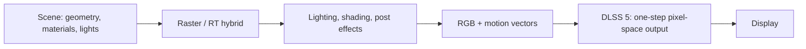

# DLSS 5 信号、指标与 PT / non-PT 流程
# DLSS 5 Signals, Metrics, and PT / non-PT Pipelines

本页把交互报告中容易混淆的四组概念拆开：DINOv2 image feature、image/albedo LPIPS、albedo/normal/depth 结构信号，以及 path-tracing（PT）和 non-PT 的上游渲染流程。

This note separates four concepts that are often conflated: DINOv2 image features, image/albedo LPIPS, albedo/normal/depth structural signals, and the upstream path-tracing (PT) versus non-PT rendering paths.

## 1. DINOv2 image feature distance / DINOv2 图像特征距离

**DINOv2** is a self-supervised vision encoder. In the report's content/identity metric, the input CG image and generated image are resized to **672×378**, passed through a corresponding **ViT-B/14** feature extractor, and compared patch by patch. The reported DINOv2 patch distance is **0.0364 for DLSS 5**, versus **0.1405 for GPT Image 2** and **0.1223 for Gemini 3 Pro**; lower is closer to the authored CG input.

DINOv2 不是“照片真实度分数”。它回答的是：

> 生成结果是否仍然保留了输入画面的内容、身份、布局和局部语义证据？

因此，一个画面可以有很低的 DINOv2 distance（很像输入），但并不一定更像照片；照片真实感由另外的盲测评估。

Resize to 672×378 makes the metric affordable and aligns the comparison with the encoder's patch grid. It is a **feature-space** distance, not a pixel-wise RGB error. The exact feature normalization and aggregation details should be treated as report-specific implementation details rather than assumed to be universal DINOv2 practice.

## 2. Image LPIPS versus albedo LPIPS / image LPIPS 与 albedo LPIPS

**LPIPS (Learned Perceptual Image Patch Similarity)** compares deep features from a learned perceptual network. Lower means the two images are perceptually closer.

The report uses two distinct variants:

| Variant | Compared signal | Resolution / role | What it tells us |
|---|---|---|---|
| **Image LPIPS** | Final RGB output vs. input CG RGB | Full 4K output in the report | Whether the displayed image preserves overall content and appearance evidence |
| **Albedo LPIPS** | Albedo estimated from output vs. albedo estimated from input | A structure/appearance diagnostic | Whether the model changed intrinsic surface color and material layout |

Image LPIPS is still not a realism metric. It penalizes perceptual changes relative to the renderer input, while the human study asks which anonymous image looks more photographic. Albedo LPIPS is even more targeted: it helps detect a model that makes a surface look photographic by changing the author's intended base color.

The report's alignment values are:

- Image LPIPS: **0.0618 / 0.3386 / 0.3112** for DLSS 5 / GPT Image 2 / Gemini 3 Pro.
- Albedo LPIPS: **0.121 / 0.204 / 0.199**.
- Albedo SSIM: **0.888 / 0.787 / 0.804**.
- Albedo PSNR: **24.79 / 20.98 / 21.17 dB**.

These metrics should be read together. LPIPS captures learned perceptual differences; SSIM emphasizes local structure; PSNR is a pixel-domain error expressed in dB.

## 3. Albedo, normal, depth / 三类结构信号

### Albedo / 反照率

Albedo is the intrinsic surface color under a neutral-light interpretation. It should not contain view-dependent highlights, cast shadows or the full illumination field. Comparing estimated albedo maps tests whether DLSS 5 preserved authored material color and object regions while adding photographic lighting cues.

### Surface normal / 表面法线

A surface normal is the local 3D orientation vector. Normal angular error measures the angle between the estimated output and input normals; **12.15°** for DLSS 5 is lower than **18.27°** and **17.84°** for the two offline baselines. Acc@11.25° counts pixels whose angular error is within 11.25°, while normal Edge F1 checks whether geometric boundaries remain aligned.

### Depth / 深度

Depth is the distance ordering of visible surfaces. The report emphasizes relative ordering with **Spearman ρ = 0.933** for DLSS 5. Depth SSIM measures local structural similarity; depth Edge F1 and Edge Chamfer measure whether depth discontinuities stay at the right locations.

### 训练期、部署期和评测期不要混为一谈

- **训练期**：albedo、normal、lighting-derived signals can act as consistency supervision.
- **部署期**：the reported runtime condition is current RGB plus motion vectors, carried temporal state and artistic controls; these G-buffers are not required as shipped inputs.
- **评测期**：a single estimator is applied to input and output to obtain comparable albedo/normal/depth maps. The estimator is a diagnostic instrument, not proof that the deployed network receives those maps.

## 4. PT path-tracing pipeline / PT 光线追踪流程

PT means a path-traced renderer: each pixel estimates light transport by sampling paths through the scene. A simplified flow is:

In practice, the PT branch may include ReSTIR, denoising, exposure and tone mapping before the DLSS 5 stage. DLSS 5 is downstream of those choices: it receives the renderer's RGB anchor and can improve appearance, but it does not trace missing rays or rewrite scene geometry.

## 5. non-PT pipeline / 非 PT 流程

non-PT refers to the report's other renderer subset, not to a single algorithm. It may be rasterization-only, raster plus ray-traced shadows/reflections, or another hybrid real-time path:

The important interface is the same: a current, pixel-registered RGB frame, motion correspondence and past state. PT and non-PT change the quality and statistics of the upstream evidence; they do not change the definition of DLSS 5 as a post-render generative stage.

## 6. How to interpret the PT / non-PT benchmark split / 如何解读拆分

The report evaluates **20 path-traced scenes and 89 non-path-traced scenes**. These are different scene subsets. Therefore:

1. The split is useful for coverage and robustness reporting.
2. A higher score on one subset does not prove that path tracing caused the difference.
3. A fair causal study would hold scene, camera, asset, output resolution and prompt fixed, then toggle only the renderer path and report paired confidence intervals.
4. PT/non-PT labels describe the **input renderer**, not two modes inside DLSS 5.

For an independent test, log the renderer path, ray budget, denoiser, motion-vector convention, exposure/tone-map placement, DLSS 5 settings, GPU clocks and queue overlap. Otherwise an apparent “DLSS 5 quality” change may actually be an upstream renderer or post-processing change.
